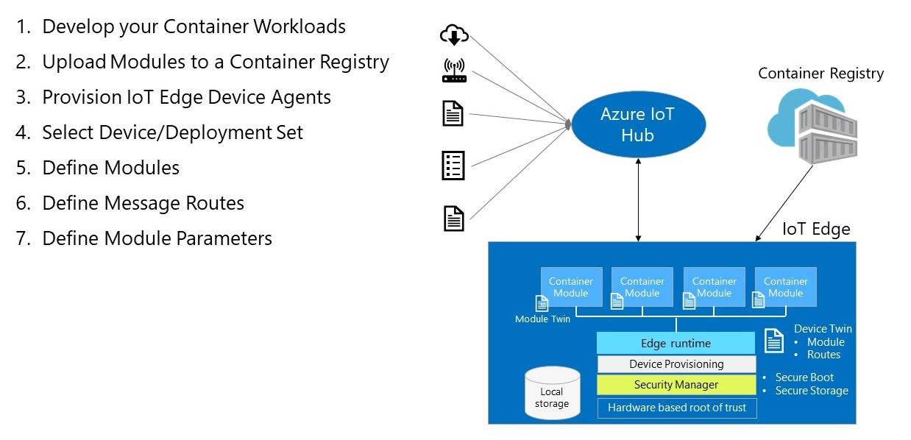

|Title |Resources|
|----|---|
|Microsoft Learn Module| [Create a image recognition solution with Azure IoT Edge and Azure Cognitive Services](http://docs.microsoft.com/learn/?WT.mc_id=iot-0000-dglover)|
|Platform| [Azure IoT Edge](https://docs.microsoft.com/azure/iot-edge/?WT.mc_id=iot-0000-dglover)|
|Documentation | [Azure IoT Edge](https://docs.microsoft.com/azure/iot-edge/?WT.mc_id=iot-0000-dglover), [Azure Custom Vision](https://docs.microsoft.com/azure/cognitive-services/custom-vision-service/getting-started-build-a-classifier/?WT.mc_id=iot-0000-dglover), [Azure Speech Services](https://docs.microsoft.com/azure/cognitive-services/speech-service/overview/?WT.mc_id=iot-0000-dglover),  [Azure Functions on Edge](https://docs.microsoft.com/azure/iot-edge/tutorial-deploy-function/?WT.mc_id=iot-0000-dglover), [Azure Stream Analytics](https://docs.microsoft.com/azure/iot-edge/tutorial-deploy-stream-analytics/?WT.mc_id=iot-0000-dglover), [Azure Machine Learning Services](https://docs.microsoft.com/azure/iot-edge/tutorial-deploy-machine-learning/?WT.mc_id=iot-0000-dglover) |
|Video Training|[Enable edge intelligence with Azure IoT Edge](https://channel9.msdn.com/events/Connect/2017/T253?WT.mc_id=iot-0000-dglover)|
|Programming Language| Python|
|Date|April 2021|

# Solution introduction

---

## Image Classification with Azure IoT Edge

There are lots of applications for image recognition but what I had in mind when developing this application was a solution for vision impaired people scanning fruit and vegetables at a self-service checkout.

---

## Solution Architecture

This solution will use three services, each with free tier services to whet your appetite.

1. [Azure IoT Hub](https://docs.microsoft.com/azure/iot-hub/?WT.mc_id=iot-0000-dglover)
2. [Azure Custom Vision](https://docs.microsoft.com/azure/cognitive-services/custom-vision-service/?WT.mc_id=iot-0000-dglover)
3. [Azure Speech Services](https://docs.microsoft.com/azure/cognitive-services/speech-service/?WT.mc_id=iot-0000-dglover)

The system identifies the item scanned against a pre-trained machine learning model, tells the person what they have just scanned, then sends a record of the transaction to a central inventory system.

The solution runs on [Azure IoT Edge](https://docs.microsoft.com/azure/iot-edge/?WT.mc_id=iot-0000-dglover) and consists of a number of services.

1. The **Camera Capture Module** handles scanning items using a camera. It then calls the Image Classification module to identify the item, a call is then made to the "Text to Speech" module to convert item label to speech, and the name of the item scanned is played on the attached speaker.  

2. The **Image Classification Module** runs a Tensorflow machine learning model that has been trained with images of fruit. It handles classifying the scanned items.

3. The **Text to Speech Module** converts the name of the item scanned from text to speech using Azure Speech Services.

4. A USB Camera is used to capture images of items to be bought.

5. A Speaker for text to speech playback.

6. **Azure IoT Hub** (Free tier) is used for managing, deploying, and reporting Azure IoT Edge devices running the solution.

7. **Azure Speech Services** (free tier) is used to generate very natural speech telling the shopper what they have just scanned.

8. **Azure Custom Vision service** was used to build the fruit model used for image classification.

---

## What is Azure IoT Edge

The solution is built on [Azure IoT Edge](https://docs.microsoft.com/azure/iot-edge/?WT.mc_id=iot-0000-dglover) which is part of the Azure IoT Hub service and is used to define, secure and deploy a solution to an edge device. It also provides cloud-based central monitoring and reporting of the edge device.

The main components for an IoT Edge solution are:-

1. The [IoT Edge Runtime](https://docs.microsoft.com/azure/iot-edge/iot-edge-runtime/?WT.mc_id=iot-0000-dglover) which is installed on the local edge device and consists of two main components. The **IoT Edge "hub"**, responsible for communications, and the **IoT Edge "agent"**, responsible for running and monitoring modules on the edge device.

2. [Modules](https://docs.microsoft.com/azure/iot-edge/iot-edge-modules/?WT.mc_id=iot-0000-dglover). Modules are the unit of deployment. Modules are docker images pulled from a registry such as the [Azure Container Registry](https://azure.microsoft.com/services/container-registry/?WT.mc_id=iot-0000-dglover), or [Docker Hub](https://hub.docker.com/). Modules can be custom developed, built as [Azure Functions](https://docs.microsoft.com/azure/iot-edge/tutorial-deploy-function/?WT.mc_id=iot-0000-dglover), or as exported services from [Azure Custom Vision](https://docs.microsoft.com/azure/iot-edge/tutorial-deploy-stream-analytics/?WT.mc_id=iot-0000-dglover), [Azure Machine Learning](https://docs.microsoft.com/azure/iot-edge/tutorial-deploy-machine-learning/?WT.mc_id=iot-0000-dglover), or [Azure Stream Analytics](https://docs.microsoft.com/azure/iot-edge/tutorial-deploy-stream-analytics/?WT.mc_id=iot-0000-dglover).

3. Routes. Routes define message paths between modules and with Azure IoT Hub.

4. Properties. You can set "desired" properties for a module from Azure IoT Hub. For example, you might want to set a threshold property for a temperature alert.

5. Create Options. Create Options tell the Docker runtime what options to start the module with. For example, you may wish to open ports for REST APIs or debugging ports, define paths to devices such as a USB Camera, set environment variables, or enable privilege mode for certain hardware operations. For more information see the [Docker API](https://docs.docker.com/engine/api/latest/) documentation.

6. [Deployment Manifest](https://docs.microsoft.com/azure/iot-edge/module-composition/?WT.mc_id=iot-0000-dglover). The Deployment Manifest pulls everything together and tells the Azure IoT Edge runtime what modules to deploy, from where, plus what message routes to set up, and what create options to start each module with.

---

## Azure IoT Edge in Action

---

## Solution Architectural Considerations

So, with that overview of Azure IoT Edge here were my considerations and constraints for the solution.

1. The solution should scale from a Raspberry Pi (running Raspberry Pi OS Linux) on ARM32v7, to my Linux desktop development environment, to an industrial capable IoT Edge device such as those found in the [Certified IoT Edge Catalog](https://devicecatalog.azure.com/?WT.mc_id=iot-0000-dglover).

2. The solution needs camera input, I used a USB Webcam for image capture as it was supported across all target devices.

---

## Let's get started

<!-- [Home](../../README.md) -->

* Module 1: [Create an Azure IoT Hub](zdocs/module_1_create_iot_hub/README.md)
* Module 2: [Install Azure IoT Edge on your Raspberry Pi](zdocs/module_2_install_azure_iot_edge/README.md)
* Module 3: [Set up your development environment](zdocs/module_3_set_up_computer/README.md)
* Module 4: [Create Azure Cognitive Services](zdocs/module_4_create_azure_resources/README.md)
* Module 5: [Build and deploy the solution](zdocs/module_5_building_the_solution/README.md)
* Module 6: [Build and deploy the solution](zdocs/module_6_camera_settings/README.md)
